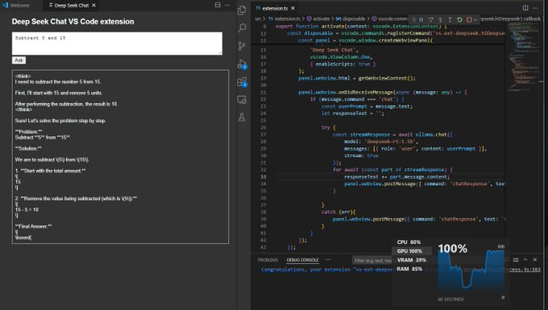

# VS Code DeepSeek Extension 🌟

Enhance your development experience with **DeepSeek**, a VS Code extension powered by Ollama's advanced AI models. This extension streamlines workflows by integrating intelligent search and AI-driven assistance directly into your IDE.

  
*Caption: Asking the DeepSeek 1.5b model to subtract in the VS Code extension.*

---

## 🚀 Features
- AI-driven search within your codebase using **DeepSeek**.
- Integration with **Ollama's 1.5b distilled models**.
- Supports efficient debugging and code understanding.
- Developed using TypeScript and optimized for performance.

---

## 🛠️ System Requirements
### Tested on:
- **Laptop:** HP Pavilion  
- **Processor:** Intel i7 (7th Generation)  
- **RAM:** 32GB DDR4  
- **Graphics Card:** 4GB NVIDIA GeForce 960MX  

---

## 📦 Getting Started
Follow the steps below to set up and run the DeepSeek extension in your VS Code environment.

### 1. Set Up the Project
Generate a new VS Code extension project:
```bash
npx --package yo --package generator-code -- yo code

    Default Values:
        Language: TypeScript
        Package Manager: npm
```

2. Install Ollama

Install Ollama to run the AI models:

```bash
curl -fsSL https://ollama.com/install.sh | sh
```

3. Pull the AI Model

Fetch the 1.5b distilled DeepSeek model:

```bash
ollama run deepseek-r1:1.5b
```

4. Compile the Extension

Before debugging, compile the TypeScript code:

```bash 
npm run compile
```

5. Go to Debugging mode to test the Extension

`F5`

🧩 Key Files

`extension.ts` : Contains the core logic for the extension.

🎥 Tutorial

This project was inspired by the tutorial from Fireship:
Watch it on YouTube
🖼️ 

VS Code Extension
🤝 Contributing

Contributions are welcome! If you’d like to improve or extend this project, feel free to open a pull request.
📧 Contact

For any questions or feedback, reach out to me via [GitHub Issues](https://github.com/syedjawadakhtar/vs-code-deepseek-ext/issues).